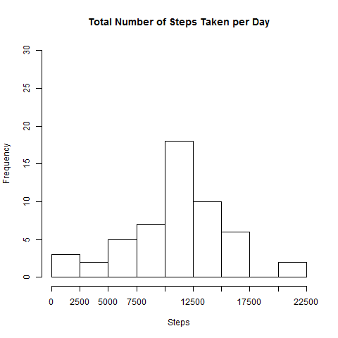
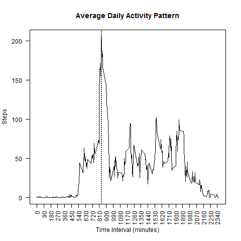
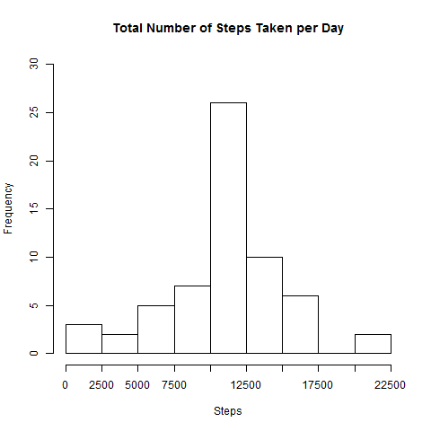
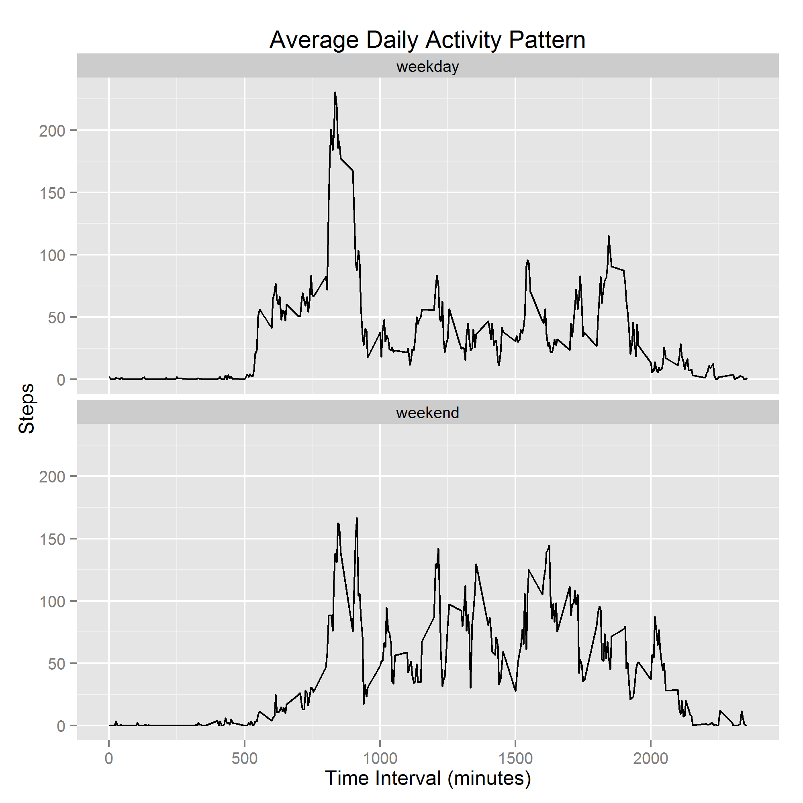

## Overview


It is now possible to collect a large amount of data about personal movement using activity monitoring devices such as a Fitbit.  But these data remain under-utilized both because the raw data are hard to obtain and there is a lack of statistical methods and software for processing and interpreting the data.

This assignment makes use of data from a personal activity monitoring device. This device collects data at 5 minute intervals through out the day. The data consists of two months of data from an anonymous individual collected during the months of October and November, 2012 and include the number of steps taken in 5 minute intervals each day.

The task was completed by separating each part of the analysis into smaller scripts of code (functions). Complete analysis is done with the analysis.R script.


## Loading and preprocessing the data


The data and scripts needed are loaded. The data is filtered to remove missing values. The cleaned data is used when missing values can be ignored.

```{r, message = FALSE, cache = TRUE}
    
    library(ggplot2)

    library(dplyr)

    source("./scripts/byDate.R")
    
    source("./scripts/byInterval.R")
    
    source('./scripts/modData.R')
    
    if (!file.exists("activity.csv")) unzip("activity.zip")
    
    data <- read.csv("activity.csv")
    
    cleanData <- filter(data, !is.na(data$steps))

```

Here is a description of the cleaned data.

```{r, echo = FALSE}
   
    str(cleanData)
     
```


## What is mean total number of steps taken per day?


The cleaned data is passed to the byDate function to generate a histogram of the number of steps taken per day. The mean and median values of steps per day are calculated. Missing values are ignored.

```{r, cache = TRUE}
   
    resultsByDate <- byDate(cleanData, 1)  ## second argument for figure file name 
    
    names(resultsByDate) <- c("mean", "median")
     
```
Code for byDate() can be found in the scripts folder.


Histogram:



Results for the mean and median values for total steps per day:

```{r, echo = FALSE}
   
    resultsByDate 
    
```


## What is the average daily activity pattern?


The clean data is passed to the byInterval function to generate a time series for the average number of steps for each time interval accross all days. The maximum number of steps is calculated and used to find the interval that corresponds to this value.

```{r, cache = TRUE}

    resultsByInterval <- byInterval(cleanData)
    
    maxInterval <- resultsByInterval[[1]]
    
    stepsByInterval <- data.frame(steps = resultsByInterval$steps, 
                                  interval = resultsByInterval$interval)

```
Code for byInterval() can be found in the scripts folder.


Time Series:



The 5-minute interval with the highest number of steps, averaged across all days, is `r maxInterval` - `r maxInterval+5` minutes.

    
## Imputing missing values


Missing values may introduce bias into calculations. The number of missing values is calculated to have a sense of how much data is missing. The data is passed to the modData function to replace missing values in the steps variable with the corresponding 5-minute interval average found in stepsByInterval.

```{r, cache = TRUE}

    missValues <- length(filter(data, is.na(data$steps))$steps)
    
    newData <- modData(data, stepsByInterval)

```    
Code for modData() can be found in the scripts folder.
    
    
The number of missing values in the data to be modified is `r missValues`.


The analysis for the total steps taken per day is due with the modified data stored in newData.  The values for the mean and median are recalculated and a new histogram is made.

```{r, cache = TRUE}

    byDateMod <- byDate(newData, 2)   ## byDate() reused for new histogram (2nd parameter for fig file name)
    
    names(byDateMod) <- c("mean", "median")
    
```
    
    
Histogram:




The mean and median values of the original and replaced data are compared in the following table:

```{r, cache = TRUE}
    
    stepsByDay <- cbind(resultsByDate, byDateMod)
    
    stepsByDay
    
```

These results show that missing values can change the skewness of a distribution. Replacing the missing values with the chosen method shifted the median towards the mean, making the distribution highly weighted close to the mean.

    
## Are there differences in activity patterns between weekdays and weekends?


This part uses the replaced data. A factor variable is inserted into the data with the values for the type of day (weekday or weekend) corresponding to the values in the date variable.  This is facilitated by the weekdays() function. 

```{r, cache = TRUE}
   
    sepData <- mutate(newData, day = weekdays(as.Date(date))) ## day variable added
    
    weekends <- c("Saturday", "Sunday")
    
    dayType = NULL
    
    for (i in sepData$day) {   ## generates dayType variable
        
        if (i %in% weekends) type = "weekend"
        
        else type = "weekday"
        
        dayType <- c(dayType, type)
        
    }
    
    sepData <- mutate(sepData, dayType = as.factor(dayType)) ## dayType variable is added
    
    sepData <- select(sepData, -c(date, day)) ## temporary variables removed from data
    
``` 

The data is grouped by interval and dayType to calculate the average steps for each interval across all days separated into weekdays and weekends. A plot comparing the time series for weekdays and weekends is generated.

```{r, cache = TRUE, results = "hide"}
    
    sepData <- group_by(sepData, interval, dayType)
    
    sepData <- summarise_each(sepData, funs(mean))
    
    png()
    
        dev.copy(png, file = "./figures/timeSeries2.png")
    
        ggplot(sepData, aes(interval, steps)) + 
            
            geom_line() + facet_wrap(~ dayType, nrow = 2) + 
            
            ggtitle("Average Daily Activity Pattern") + 
            
            xlab("Time Interval (minutes)") + ylab("Steps")
        
    dev.off()
    
```


Time Series:


