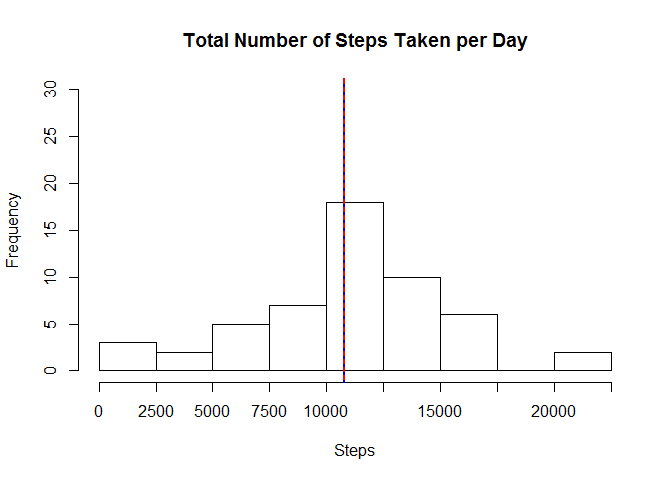
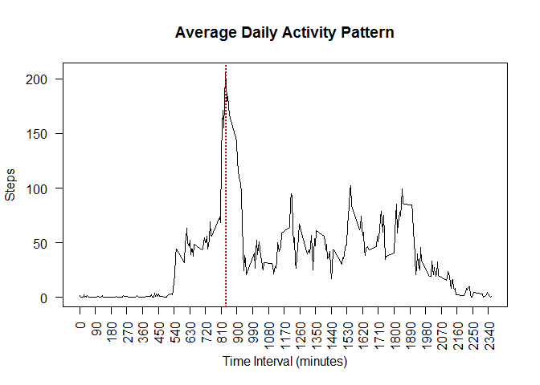
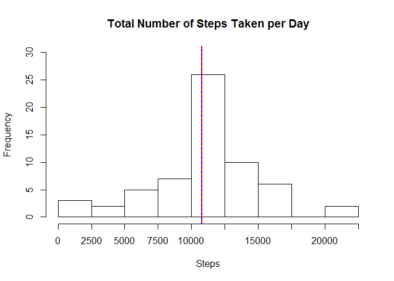
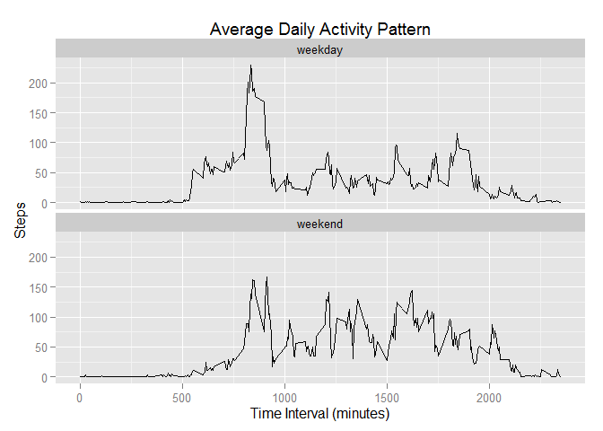

# Reproducible Research: Peer Assessment 1
Norbert J. Cruz Lebrón  
August 16, 2015  

## Overview
  
    
It is now possible to collect a large amount of data about personal movement using activity monitoring devices such as a Fitbit.  But these data remain under-utilized both because the raw data are hard to obtain and there is a lack of statistical methods and software for processing and interpreting the data.  

This assignment makes use of data from a personal activity monitoring device. This device collects data at 5 minute intervals through out the day. The data consists of two months of data from an anonymous individual collected during the months of October and November, 2012 and include the number of steps taken in 5 minute intervals each day.  
  
    
## Loading and preprocessing the data
  
The packages needed are loaded. The data is filtered to remove missing values. The filtered data is used when missing values are to be ignored.


```r
    library(ggplot2)

    library(dplyr)
    
    if (!file.exists("activity.csv")) unzip("activity.zip")
    
    data <- read.csv("activity.csv")
    
    cleanData <- filter(data, !is.na(data$steps))
```
  
    
    
Here is a description of the cleaned data.


```
## 'data.frame':	15264 obs. of  3 variables:
##  $ steps   : int  0 0 0 0 0 0 0 0 0 0 ...
##  $ date    : Factor w/ 61 levels "2012-10-01","2012-10-02",..: 2 2 2 2 2 2 2 2 2 2 ...
##  $ interval: int  0 5 10 15 20 25 30 35 40 45 ...
```
  
  
## What is the mean total number of steps taken per day?
  
The clean data is grouped by date to calculated the total number of steps in each day. The mean, median and maximum number of steps per day are calculated. Missing values are ignored.


```r
    dataByDate <- group_by(cleanData, date)  ## groups data by date
    
    dataByDate <- select(dataByDate, -interval)  ## removes the interval variable
    
    stepsSum <- summarise_each(dataByDate, funs(sum))  ## calculates total steps for each day
    
    meanByDate <- mean(stepsSum$steps)
    
    medianByDate <- median(stepsSum$steps)
    
    maxSteps <- max(stepsSum$steps)
    
    maxSteps
```

```
## [1] 21194
```
Maximum number of steps.  
  
  
This information is used to generate a histogram for the number of steps per day.


```r
    bins <- seq(0, 22500, 2500) ## based on maxSteps value
    
    hist(stepsSum$steps, breaks = bins, ylim = c(0, 30), xaxt = 'n', 
         
        main = "Total Number of Steps Taken per Day", xlab = "Steps")
    
    axis(1, at = bins, labels = bins)
        
    abline(v = meanByDate, col = "red", lwd = 2)
        
    abline(v = medianByDate, col = "blue", lwd = 2, lty = 3)
```

 
  
Mean and median values are represented by the red and blue lines respectively.  
  
  
Results for the mean and median values for total steps per day:


```r
    resultsByDate <- c(mean = meanByDate, median = medianByDate)
    
    resultsByDate
```

```
##     mean   median 
## 10766.19 10765.00
```
  
  
## What is the average daily activity pattern?
  
  
The clean data is used to calculated the maximum number of steps across intervals and used to find the interval that corresponds to this value.


```r
    dataByInterval <- group_by(cleanData, interval)
    
    dataByInterval <- select(dataByInterval, -date)
    
    stepsByInterval <- summarise_each(dataByInterval, funs(mean))
    
    maxByInterval <- max(stepsByInterval$steps)
    
    maxInterval <- stepsByInterval$interval[stepsByInterval$steps == maxByInterval]
    
    maxInterval
```

```
## [1] 835
```
Lower end of interval with maximum steps.  
  
  
This information is used to generate a time series for the average number of steps for each time interval accross all days.


```r
    par(las = 2)
    
    bins <- seq(0, max(unique(stepsByInterval$interval)), 90)

    plot(stepsByInterval$interval, stepsByInterval$steps, type = "l", 
         
        main = "Average Daily Activity Pattern", xlab = "Time Interval (minutes)", 
    
        ylab = "Steps", xaxt = 'n')
        
    axis(1, at = bins, labels = bins)
        
    abline(v = maxInterval, col = "red", lty = 3)
        
    abline(v = maxInterval+5, col = "blue", lty = 3)
```

 

The 5-minute interval with the highest number of steps, averaged across all days, is 835 - 840 minutes. (Represented by the red and blue lines)  
  
    
## Imputing missing values

Missing values may introduce bias into calculations. The number of missing values is calculated to have a sense of how much data is missing. The missing values in the steps variable are replaced with the corresponding 5-minute interval average.


```r
    missValues <- length(filter(data, is.na(data$steps))$steps)
    
    missValues
```

```
## [1] 2304
```
Number of missing values in the steps variable.  
  
  
The data with the missing values is modified by replacing them with corresponding 5-minute interval averages. The values for the mean and median are recalculated and a new histogram is made.


```r
    modData <- data
    
    for (i in unique(modData$date)) {
        
        for (j in unique(modData$interval)) {
            
            if (is.na(modData[modData$date == i & modData$interval == j, "steps"])) {
                
                modData[modData$date == i & modData$interval == j, "steps"] <- 
                    
                    stepsByInterval[stepsByInterval$interval == j, "steps"]
                
            }  ## if ends
            
        }  ## 2nd for ends
        
    } ## 1st for ends
    
    modDataByDate <- group_by(modData, date)  ## groups data by date
    
    modDataByDate <- select(modDataByDate, -interval)  ## removes the interval variable
    
    modStepsSum <- summarise_each(modDataByDate, funs(sum))  ## calculates total steps for each day
    
    modMeanByDate <- mean(modStepsSum$steps)
    
    modMedianByDate <- median(modStepsSum$steps)
    
    modResultsByDate <- c(mean = modMeanByDate, median = modMedianByDate)
```
      
      
Histogram:


```r
    bins <- seq(0, 22500, 2500)
    
    hist(modStepsSum$steps, breaks = bins, ylim = c(0, 30), xaxt = 'n', 
         
        main = "Total Number of Steps Taken per Day", xlab = "Steps")
    
    axis(1, at = bins, labels = bins)
    
    abline(v = modMeanByDate, col = "red", lwd = 2)
    
    abline(v = modMedianByDate, col = "blue", lty = 3, lwd = 2)
```

 
  
Mean and median values are represented by the red and blue lines.
  
  
The mean and median values of the original and replaced data are compared in the following table:


```r
    cbind(resultsByDate, modResultsByDate)
```

```
##        resultsByDate modResultsByDate
## mean        10766.19         10766.19
## median      10765.00         10766.19
```
  
Results show that missing values can change the skewness of a distribution. Replacing the missing values with the chosen method shifted the median towards the mean, giving more weight to the distribution around the mean. In this case, the effect appears to be negligible.  
  
  
## Are there differences in activity patterns between weekdays and weekends?
  
  
This part uses the modified data. A factor variable is inserted into the data with the values for the type of day (weekday or weekend) corresponding to the values in the date variable.  This is facilitated by the weekdays() function. 


```r
    sepData <- mutate(modData, day = weekdays(as.Date(date))) ## day variable added
    
    weekends <- c("Saturday", "Sunday")
    
    dayType = NULL
    
    for (i in sepData$day) {   ## generates dayType variable
        
        if (i %in% weekends) type = "weekend"
        
        else type = "weekday"
        
        dayType <- c(dayType, type)
        
    }
    
    sepData <- mutate(sepData, dayType = as.factor(dayType)) ## dayType variable is added
    
    sepData <- select(sepData, -c(date, day)) ## temporary variables removed from data
```
  
The data is grouped by interval and dayType to calculate the average steps for each interval across all days separated into weekdays and weekends. A plot comparing the time series for weekdays and weekends is generated.


```r
    sepData <- group_by(sepData, interval, dayType)
    
    sepData <- summarise_each(sepData, funs(mean))
    
    ggplot(sepData, aes(interval, steps)) + 
            
            geom_line() + facet_wrap(~ dayType, nrow = 2) + 
            
            ggtitle("Average Daily Activity Pattern") + 
            
            xlab("Time Interval (minutes)") + ylab("Steps")
```

 
  
The plot shows more activity during weekends overall. On the other hand, peak activity appears to be concentrated at a time interval during weekdays. It seems to correspond to the interval containing maximum activity for the complete data.
